```{r setup, include=FALSE}
knitr::opts_chunk$set(echo = TRUE)
```

<style type="text/css">

h1.title {
  font-size: 38px;
  color: Black;
  text-align: center;
}
h3.subtitle {
  font-size: 38px;
  color: Black;
  text-align: center;
}
h4.author { 
    font-size: 18px;
  /*font-family: "Times New Roman", Times, serif;*/
  color: DarkBlue;
  text-align: center;
}
h4.date { 
  font-size: 18px;
  /*font-family: "Times New Roman", Times, serif;*/
  color: CornflowerBlue;
  text-align: center;
}
h1 {
  font-size: 38px;
  color: Black;
}
h2 {
  color: DarkBlue;
}
h3 {
  color: CornflowerBlue;
}
h4 {
  color: LightSlateGray;
}
</style>

# 0. Prerequisites
Before you get started, make sure you have [R](https://www.r-project.org/) and [RStudio](https://www.rstudio.com/) installed on your machine. If you don't have these installed on your machine, the following are instructions for you to install this software.

## 0.1 Installing R
R is a powerful, open-source statistical programming language that anyone can download for free! You can simply go to [CRAN's website](https://www.r-project.org/) and install R by following these steps:

### 0.1.1 Under the 'Download' heading, select 'CRAN'
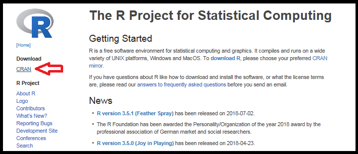

### 0.1.2 Install a CRAN Mirror

Install the CRAN mirror that's nearest to your geographic location. For example, if you live in Orange County, California, you should install the [UCLA CRAN Mirror.](http://cran.stat.ucla.edu/)

### 0.1.3 Install your Machine's Version of R
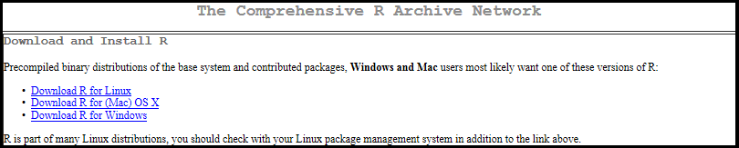

#### 0.1.3.1 R for Windows


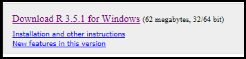

#### 0.1.3.2 R for (Mac) OS X
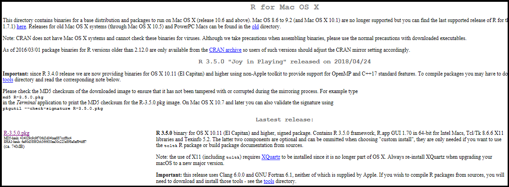

#### 0.1.3.3 R for Linux
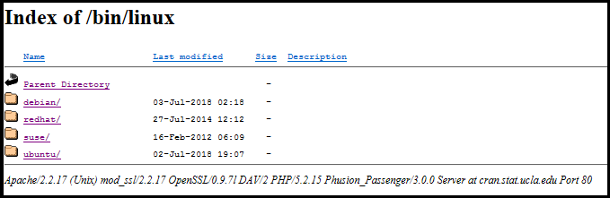

## 0.2 Installing RStudio
RStudio is an open-source professional software that makes R much easier to use. Download the free, open-source license version from [RStudio's website](https://www.rstudio.com/products/rstudio/download/#download). The installation steps are very similar to those of R's for all operating systems.

# 1. Importing and Exporting Excel Files in R
The open-source community has developed a few smooth and convenient ways for you to upload and download Excel files in R.

## 1.1 Importing Excel Files to R
Install the `readxl` package into RStudio by typing 

```{r, eval=FALSE}
install.packages("readxl")
``` 

into the Console.

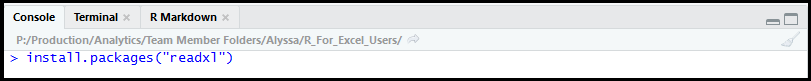


After the package is finished installing, call the package by typing 

```{r, eval=FALSE} 
library(readxl)
``` 

into the Console. You can now upload your Excel file into R (and assign it to the variable `data`) by typing

```{r, eval=FALSE} 
data <- read_excel("D:/path/file.xlsx")
``` 

into the Console.

Another way you can import an Excel file into R after calling the `readxl` library is to, in RStudio, go to `File > Import Dataset > From Excel`, and browse for your Excel file.

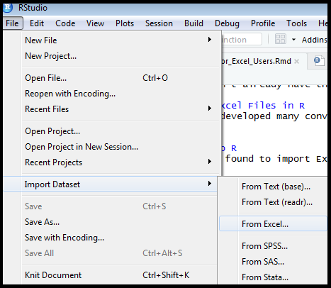


After you're satisfied with how your data is being imported, select `Import` on the bottom right of the window, and your Excel data will be imported into R.

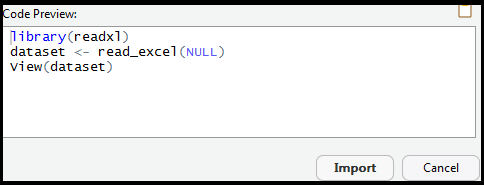

## 1.2 Exporting Excel Files from R
Install the `openxlsx` package into RStudio by typing 

```{r, eval=FALSE}
install.packages("openxlsx")
```  

into the Console.

After the package is finished installing, call the package by typing 

```{r, eval=FALSE} 
library(openxlsx)
``` 

into the Console. You can now download your data (assigned to the variable `data` here) to a custom file name by typing

```{r, eval=FALSE} 
write.xlsx(data, file = "D:/path/your_file_name.xlsx")
``` 

into the Console.

# 2. How to Transition From Excel to R

## 2.1 Navigating RStudio

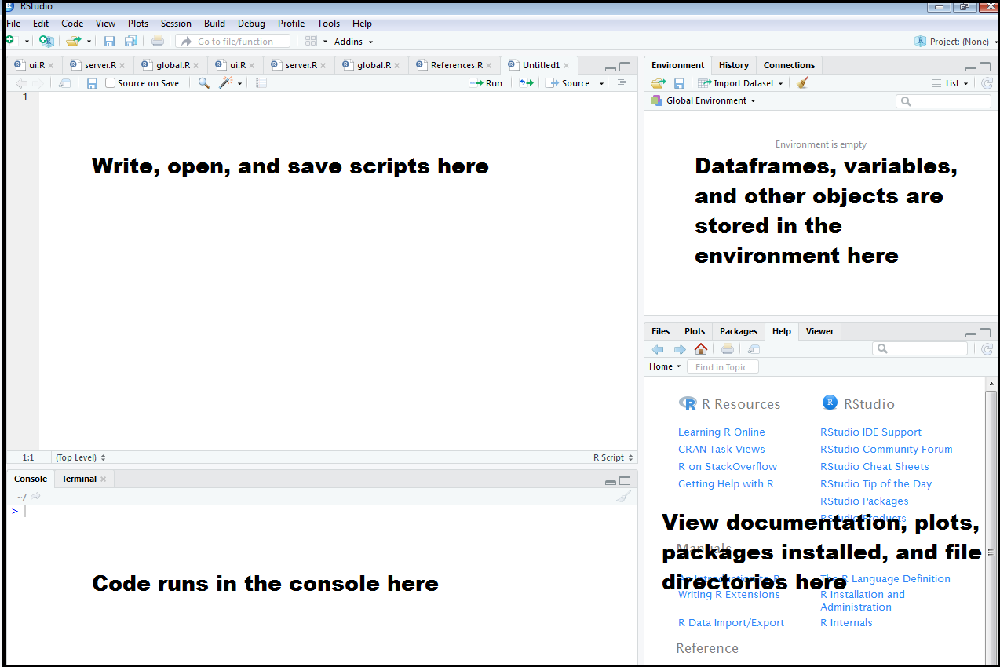

## 2.2 Data Structures and Variables in R

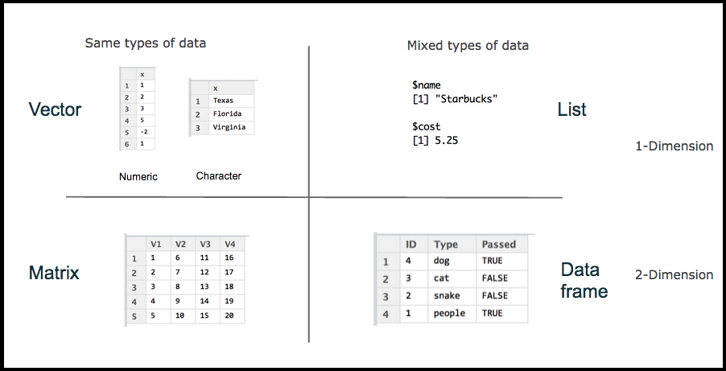


Try to get comfortable with the different types of data structures in R.

Excel spreadsheets are typically recognized as **dataframes** in R, which are composed of multiple lists.

### 2.2.1 Creating Your First Dataframe

Start by creating some lists and assigning them to variables using `<-` (not `=`, as this may confuse R in some function calls):

```{r}
teams <- c("Angels","Dodgers","Cubs") # c() command stands for combine; use whenever creating a list of objects in R
wins <- c(70,56,64)
ca_team <- c(TRUE, TRUE, FALSE)

baseball <- data.frame(teams,wins,ca_team) # combine lists into dataframe

baseball # view the dataframe
```

Now you have a dataframe with 3 columns, or lists (string, numeric, and boolean).

## 2.3 Working with Dataframes

### 2.3.1 Looking Up Number of Observations

Using the `iris` dataset that comes with R, and the `nrow()` function, you can find the number of observations or rows:

```{r}
# View(iris) # use this command to view the iris dataset
nrow(iris) # displays the number of rows in the iris dataset
```

Similarly, you can also find the number of columns:

```{r}
ncol(iris) # displays the number of columns in the iris dataset
```

To find the number of rows and columns at the same time, use `dim()`:

```{r}
dim(iris)
```

### 2.3.2 Focusing on the First/Last X Rows

```{r}
head(iris, 10) # displays the first 10 rows of the iris dataset
tail(iris, 10) # displays the last 10 rows of the iris dataset
```

### 2.3.3 Looking at the Structure of a Dataframe

```{r}
str(iris) # investigate the structure of the iris dataframe
```

### 2.3.4 Focusing on Certain Columns, Rows, or Cells

Sometimes you may want to look at a single cell, column, or row. To do so, add brackets to the dataframe in the console, like: 

```{r, eval=F}
iris[1,3] # look at the value in the 1st row, 3rd column

iris[1,] # look at all of the values in the 1st row; don't forget the comma!

iris[,3] # look at all of the values in the 3rd column; iris[3] also works

iris[1:3,] # look at all of the values in rows 1 through 3; ':' can also be applied to selecting columns
```

A helpful phrase to remember is "Data RoCks!" As in, `Dataframe[Rownumber,Columnnumber]`.

Most of the time, it's difficult to reference columns by number - especially when there's so many columns. Here are alternative ways to select one or multiple columns:

```{r, eval=F}
iris$Sepal.Length # selecting the one Sepal.Length column from the iris dataset

iris$Sepal.Length[3] # selecting the 3rd value in the Sepal.Length column, or the 3rd row value in the Sepal.Length column

iris[c("Sepal.Length","Sepal.Width")] # selecting multiple columns (Sepal.Length, Sepal.Width) from the iris dataset
```

### 2.3.5 Changing the Format of a Column

Say you imported a dataset from Excel with `$` or `%` signs appended to some numeric values. If you didn't specify these values to be numeric when you imported your dataset, R will likely interpret those values to be strings instead of currency or percentages. This means that R will not be able to perform calculations with these values. 

However, in the R console, you can perform the following short commands to remove `$` or `%` signs and convert the string values to numeric values that can then be used in calculations:

```{r,eval=F}
# delete the dollar signs in a currency column in the dataset
dataset$currency <- gsub("\\$", "", dataset$currency)
# change the format of the currency column to numeric
dataset$currency <- as.numeric(dataset$currency)

# similarly, with percentages, delete the percent signs in a percentages column in the dataset
dataset$percentages <- gsub("\\%", "", dataset$percentages)
# change the format of the percentages column to numeric
dataset$percentages <- as.numeric(dataset$percentages)
```

### 2.3.6 Sorting a Dataframe Based on One Column

Back to the `iris` dataset:

```{r,eval=T}
iris_sort_lg <- iris[order(iris$Sepal.Length),] # order the iris dataset from least to greatest value of Sepal.Length
iris_sort_lg
iris_sort_gl <- iris[order(-iris$Sepal.Length),] # order the iris dataset from greatest to least value of Sepal.Length
iris_sort_gl
```

### 2.3.7 Filtering Data by Column Content

```{r}
# Create a new dataset called 'iris2' that only contains Sepal.Length > 6.7
iris2 <- subset(iris, Sepal.Length > 6.7)
iris2
```

### 2.3.8 Calculating Quantities with Columns

```{r}
# Adding 2 columns and assigning values to new column, Sepal_Sum
iris$Sepal_Sum <- iris$Sepal.Length + iris$Sepal.Width

# Subtracting 2 columns and assigning values to new column, Sepal_Diff
iris$Sepal_Diff <- iris$Sepal.Length - iris$Sepal.Width

head(iris)
```

### 2.3.9 Calculations on Columns

```{r}
# Adding the values of the Sepal.Length column and assigning the value to sepal_sum
sepal_sum <- sum(iris$Sepal.Length)
sepal_sum

# Finding the average of the values of the Sepal.Length column and assigning the value to sepal_avg
sepal_avg <- mean(iris$Sepal.Length)
sepal_avg

# Finding the median of the values of the Sepal.Length column and assigning the value to sepal_median
sepal_median <- median(iris$Sepal.Length)
sepal_median
```

## 2.4 File Names and Version Control

### 2.4.1 File Names

As in Excel spreadsheets, the file names of R scripts are important, as they need to be discernable by both users and computers.

Here are some bad examples of file names:

```
myscript.R
Joe's Filenames Use Spaces and Punctuation;"'.R
figure 1.R
fig 2.R
JW7d^(2sl@pleasedontdeletethisWx2*.R
```

and here are some good examples of file names:

```
2010-07-17_disneyland-55th-bday.R
joes-filenames-are-getting-better.R
fig01_scatterplot-length-vs-interest.R
fig02_histogram-attendance.R
2018-06-18_predictive-modeling-contest-week1.R
```

The following sections detail why the above examples are categorized as good and bad file names.

#### 2.4.1.1 Three Principles of Good File Names

**1. Machine readable**

Avoid spaces, punctuation, accented characters, and case sensitivity to achieve optimal machine readability. Make your file names easy to compute on with a deliberate use of delimiters.

The deliberate use of `_` and `-` allows you to recover metadata from the file names.

For example, for the following filenames,

```
2018-07-05_Q2ANALYSIS_GMWB-Mix_T01.R
2018-07-05_Q2ANALYSIS_GMWB-Mix_T02.R
2018-07-05_Q2ANALYSIS_GMWB-Mix_T03.R
2018-07-05_Q2ANALYSIS_GMWB-Mix_all.R
...
2018-07-18_Q2ANALYSIS_Non-GMWB-Mix_T01.R
2018-07-18_Q2ANALYSIS_Non-GMWB-Mix_T02.R
2018-07-18_Q2ANALYSIS_Non-GMWB-Mix_P01.R
2018-07-18_Q2ANALYSIS_Non-GMWB-Mix_P02.R
2018-07-18_Q2ANALYSIS_Non-GMWB-Mix_all.R
```

you can create a list of file names only containing "Non-GMWB-Mix" in R by typing the following into the Console.

```{r,eval=F}
# Make sure you have the `dplyr` package installed first!
flist <- list.files(pattern = "Non-GMWB-Mix") %>% head
```

If you also type

```{r,eval=F}
# Make sure you have the `stringr` package installed first!
stringr::str_split_fixed(flist,"[_\\.]",4)
```

into the Console, the date, quarter analysis, analysis type, and output type will be displayed separately, creating a nicely organized metadata table. 

The underscore `_` is used to delimit units of metadata you want to retrieve later, and the hyphen `-` is used to delimit separate words within these units of metadata.

By making your file names machine readable, you make it easy to:

1. search for files later,

2. narrow file lists based on names, and

3. extract information from file names (e.g. by splitting).

**2. Human readable**

Include information on content in your file names to make them human readable. This connects with the concept of slugs from [semantic URLs](http://en.wikipedia.org/wiki/Semantic_URL).

For example, 

```
2018-07-05_Q2ANALYSIS_GMWB-Mix_T01.R
2018-07-05_Q2ANALYSIS_GMWB-Mix_T02.R
2018-07-05_Q2ANALYSIS_GMWB-Mix_T03.R
2018-07-05_Q2ANALYSIS_GMWB-Mix_all.R
...
2018-07-18_Q2ANALYSIS_Non-GMWB-Mix_T01.R
2018-07-18_Q2ANALYSIS_Non-GMWB-Mix_T02.R
2018-07-18_Q2ANALYSIS_Non-GMWB-Mix_P01.R
2018-07-18_Q2ANALYSIS_Non-GMWB-Mix_P02.R
2018-07-18_Q2ANALYSIS_Non-GMWB-Mix_all.R
```

these file names "embrace the slug" by having each of the subanalyses and subtypes in the Q2 Analysis labeled at the end of each file name. 

"Embracing the slug" allows you to more easily figure out which R files you're looking at or trying to find.

**3. Plays well with default ordering**

To play well with default ordering, you need to:

1. put something numeric first,

2. use the ISO 8601 standard for dates (YYYY-MM-DD), and

3. left-pad other numbers with zeros.

Our example file names

```
2018-07-05_Q2ANALYSIS_GMWB-Mix_T01.R
2018-07-05_Q2ANALYSIS_GMWB-Mix_T02.R
2018-07-05_Q2ANALYSIS_GMWB-Mix_T03.R
2018-07-05_Q2ANALYSIS_GMWB-Mix_all.R
...
2018-07-18_Q2ANALYSIS_Non-GMWB-Mix_T01.R
2018-07-18_Q2ANALYSIS_Non-GMWB-Mix_T02.R
2018-07-18_Q2ANALYSIS_Non-GMWB-Mix_P01.R
2018-07-18_Q2ANALYSIS_Non-GMWB-Mix_P02.R
2018-07-18_Q2ANALYSIS_Non-GMWB-Mix_all.R
```

put something numeric first (the date, which also fits the ISO 8601 standard), so they're organized in chronological order. Also, the version numbers at the end of each file name are left-padded with zeros so when double-digit versions are created, the later versions won't be ordered before the single-digit versions.

### 2.4.2 Version Control

An example of a series of good file names for version control is:

```
2018-07-05_Q2ANALYSIS_GMWB-Mix_T01.R
2018-07-05_Q2ANALYSIS_GMWB-Mix_T02.R
2018-07-05_Q2ANALYSIS_GMWB-Mix_T03.R
2018-07-05_Q2ANALYSIS_GMWB-Mix_all.R
...
2018-07-18_Q2ANALYSIS_Non-GMWB-Mix_T01.R
2018-07-18_Q2ANALYSIS_Non-GMWB-Mix_T02.R
2018-07-18_Q2ANALYSIS_Non-GMWB-Mix_P01.R
2018-07-18_Q2ANALYSIS_Non-GMWB-Mix_P02.R
2018-07-18_Q2ANALYSIS_Non-GMWB-Mix_all.R
```

Note how these file names not only follow all of the conventions for good file names, but they also indicate the type of script (with `T` for table(s) and `P` for plot(s)) and version number at the end.

# 3. Common Excel Functions in R

To find more information about how to use each of these R functions, type `?function` (e.g. `?sum`) in the RStudio Console, and you'll be provided with comprehensive and clear R documentation. If you need even more information about an R function, type "how to use ___ function in R" or something similar into Google.

| Excel Formula | R Function | Type |
|---------------|------------|------|
| ABS | `abs` | Arithmetic |
| ADDRESS | `assign` | Essentials |
| AND | `&`,`&&`,`all` | Boolean |
| AVERAGE, AVG, AVERAGEIF | `mean` | Arithmetic | 
| BETADIST | `pbeta` | Statistics |
| BETAINV | `qbeta` | Statistics |
| BINOMDIST | `pbinom` when cumulative,`dbinom` when not | Statistics |
| CEILING | `ceiling` | Arithmetic |
| CELL | `str` has the same idea | Essentials |
| CHIDIST, CHISQDIST | `pchisq` | Statistics |
| CHIINV, CHISQINV | `qchisq` | Statistics |
| CHITEST | `chisq.test` | Statistics |
| CHOOSE | `switch` | Essentials |
| CLEAN | `gsub` | Text |
| COLS, COLUMNS | `ncol` | Essentials |
| COLUMN | `col`,`:`,`seq` | Essentials |
| COMBIN | `choose` | Essentals |
| CONCATENATE | `paste` | Text |
| CONFIDENCE | `-qnorm(alpha/2)*std/sqrt(n)` | Statistics |
| CORREL | `cor` | Statistics |
| COUNT, COUNTIF | `length` | Arithmetic |
| COVAR | `cov` | Statistics |
| CRITBINOM | `qbinom` | Statistics |
| DELTA | `identical` | Boolean |
| EXACT | `==` | Boolean |
| EXP | `exp` | Arithmetic |
| EXPONDIST | `pexp` when cumulative,`dexp` when not | Statistics |
| FACT | `factorial` | Arithmetic |
| FACTDOUBLE | `dfactorial` in the `phangorn` package | Arithmetic |
| FDIST | `pf` | Statistics |
| FIND | `regexpr`,`grepl`,`grep` | Text |
| FINV | `qf` | Statistics |
| FISHER | `atanh` | Arithmetic |
| FISHERINV | `tanh` | Arithmetic |
| FIXED | `format`,`sprintf`,`formatC` | Essentials |
| FLOOR | `floor` | Arithmetic |
| FORECAST | `predict` on an `lm` object | Statistics |
| FREQUENCY | `cut`,`table` | Arithmetic |
| FTEST | `var.test` | Statistics |
| GAMMADIST | `pgamma` if last argument T,`dgamma` if last arg. F | Statistics |
| GAMMAINV | `qgamma` | Statistics |
| GAMMALN | `lgamma` | Statistics |
| GAUSS | `pnorm(x) - 0.5` | Statistics |
| GCD | `gcd` | Arithmetic |
| GEOMEAN | `exp(mean(log(x)))` | Arithmetic |
| GESTEP | `>=` | Boolean |
| HARMEAN | `harmonic.mean` in the `psych` package | Arithmetic |
| HLOOKUP | `match`,`merge` | Essentials |
| HYPGEOMDIST | `dhyper` | Statistics |
| IF | `if`,`ifelse` | Essentials |
| IFERROR | `try`,`tryCatch` | Essentials |
| INDEX | `x[y,z]` | Essentials |
| INDIRECT | `get` | Essentials |
| INT | `as.integer`(not for negative numbers),`floor` | Arithmetic |
| INTERCEPT | first element of `coef` of an `lm` object | Statistics |
| ISLOGICAL | `is.logical` | Boolean |
| ISNA | `is.na` | Boolean |
| ISNUMBER | `is.numeric` | Boolean |
| ISTEXT | `is.character` | Boolean |
| KURT | `kurtosis` in the `moments` package | Statistics |
| LARGE | `sort` | Statistics |
| LCM | `scm` in the `schoolmath` package | Arithmetic |
| LEFT | `substr` | Text |
| LEN, LENGTH | `nchar` | Text |
| LINEST | `lm` | Statistics |
| LN, LOG | `log` | Arithmetic |
| LOG10 | `log10` | Arithmetic |
| LOGINV | `qlnorm` | Statistics |
| LOGNORMDIST | `plnorm` | Statistics |
| LOWER | `tolower` | Text |
| MATCH | `match`,`which` | Essentials |
| MAX | `max` (sometimes `pmax`) | Arithmetic |
| MDETERM | `det` | Arithmetic |
| MEDIAN | `median` | Arithmetic |
| MID | `substr` | Text |
| MIN | `min` (sometimes `pmin`) | Arithmetic |
| MINVERSE | `solve` | Arithmetic |
| MMULT | `%*%` | Arithmetic |
| MOD | `%%` | Arithmetic |
| MODE | `as.numeric(names(which.max(table(x))))` | Arithmetic |
| MUNIT | `diag` | Arithmetic |
| N | `as.numeric` | Arithmetic |
| NEGBINOMDIST | `dnbinom` | Statistics |
| NORMDIST, NORMSDIST | `pnorm` when cumulative,`dnorm` when not | Statistics |
| NORMINV, NORMSINV | `qnorm` | Statistics |
| NOT | `!` | Boolean |
| NOW | `date`,`Sys.time` | Essentials |
| OR | `|`,`||`,`any` | Boolean |
| PEARSON | `cor` | Statistics |
| PERCENTILE | `quantile` | Statistics |
| PERCENTRANK | `ecdf` | Statistics |
| PERMUT | `function(n,k) {choose(n,k)*factorial(k)}` | Arithmetic |
| PERMUTATIONA | `n^k` | Arithmetic |
| PHI | `dnorm` | Statistics |
| POISSON | `ppois` when cumulatic,`dpois` when not | Statistics |
| POWER | `^` | Arithmetic |
| PROB | `ecdf` | Statistics |
| PRODUCT | `prod` | Arithmetic |
| PROPER | `toupper` | Text |
| QUARTILE | `quantile` | Arithmetic |
| QUOTIENT | `%/%` | Arithmetic |
| RAND | `runif` | Arithmetic |
| RANDBETWEEN | `sample` | Arithmetic |
| RANK | `rank` | Essentials |
| REPLACE | `sub`,`gsub` | Text |
| REPT | `rep` and `paste` or `paste0` | Text |
| RIGHT | `substring` | Text |
| ROUND | `round` | Arithmetic |
| ROUNDDOWN | `floor` | Arithmetic |
| ROUNDUP | `ceiling` | Arithmetic |
| ROW | `row`,`:`,`seq` | Essentials |
| ROWS | `nrow` | Essentials |
| RSQ | `summary` of `lm` object | Statistics |
| SEARCH | `regexpr`,`grep` | Text |
| SIGN | `sign` | Arithmetic |
| SKEW | `skewness` in the `moments` package | Statistics |
| SLOPE | in `coef` of `lm` object | Statistics |
| SMALL | `sort` | Arithmetic |
| SQRT | `sqrt` | Arithmetic |
| STANDARDIZE | `scale` | Statitics |
| STD, STDEV | `sd` | Arithmetic |
| STEYX | `predict` on an `lm` object | Statistics |
| STRING | `format`,`sprintf`,`formatC` | Text |
| SUBSTITUTE | `sub`,`gsub`,`paste` | Essentials |
| SUM, SUMIF | `sum` | Arithmetic |
| SUMPRODUCT | `crossprod` | Arithmetic |
| TDIST | `pt` | Statistics |
| TEXT | `format`,`sprintf`,`formatC` | Text |
| TINV | `abs(qt(x/2,data))` | Statistics |
| TODAY | `Sys.Date` | Essentials |
| TRANSPOSE | `t` | Arithmetic |
| TREND | `fitted` of an `lm` object | Statistics |
| TRIM | `sub` | Essentials |
| TRIMMEAN | `mean(x,trim=tr/2)` | Arithmetic |
| TRUNC | `trunc` | Essentials |
| TTEST | `t.test` | Statistics |
| TYPE | `typeof`,`mode`,`class` | Essentials |
| UPPER | `toupper` | Text |
| VALUE | `as.numeric` | Arithmetic |
| VAR | `var` | Essentials |
| VLOOKUP | `match`,`merge` | Essentials |
| WEEKDAY | `weekdays` | Essentials |
| WEIBULL | `pweibull` when cumulative,`dweibull` when not | Statistics |
| ZTEST | `pnorm` | Statistics | 

# 4. Common Excel Plots in R

## 4.1 Distribution Plots

### 4.1.1 Density Plot

Using the `iris` dataset that's pre-installed in R,

```{r,eval=T}
# If you don't have the ggplot2 library, be sure to
# install it by typing `install.packages("ggplot2")`
# into the Console.
library(ggplot2)  

ggplot(iris, aes(Petal.Width, colour=Species, fill=Species)) +
  geom_density(alpha=0.55)
```

### 4.1.2 Histogram

Using the `iris` dataset that's pre-installed in R,

```{r,eval=T}
# If you don't have the ggplot2 library, be sure to
# install it by typing `install.packages("ggplot2")`
# into the Console.
library(ggplot2)

# Basic histogram
ggplot(iris, aes(x=Petal.Width)) + geom_histogram()
 
# Custom Bin Width
ggplot(iris, aes(x=Petal.Width)) + geom_histogram(binwidth = 0.05)

# Custom color
ggplot(iris, aes(x=Petal.Width)) + 
    geom_histogram(binwidth = 0.2, color="white",
                   fill=rgb(0.2,0.7,0.1,0.4)) 
```

### 4.1.3 Boxplot (Box and Whisker Plot)

Using the `iris` dataset that's pre-installed in R,

```{r,eval=T}
# If you don't have the ggplot2 library, be sure to
# install it by typing `install.packages("ggplot2")`
# into the Console.
library(ggplot2)

ggplot(iris, aes(x=Species, y=Petal.Width)) + 
    geom_boxplot(fill="slateblue", alpha=0.2)
```

## 4.2 Correlation Plots

### 4.2.1 Scatterplot

Using the `iris` dataset that's pre-installed in R,

```{r,eval=T}
# If you don't have the ggplot2 library, be sure to
# install it by typing `install.packages("ggplot2")`
# into the Console.
library(ggplot2)

# Basic scatterplot
ggplot(iris, aes(x=Sepal.Length, y=Sepal.Width)) + 
    geom_point()

# Basic scatterplot with regression line
ggplot(iris, aes(x=Sepal.Length, y=Sepal.Width)) +
    geom_smooth(method = 'lm', formula = y~x) +
    geom_point()

# Basic connected scatterplot
ggplot(iris, aes(x=Sepal.Length, y=Sepal.Width)) + 
    geom_line() +
    geom_point()
```

### 4.2.2 Heatmap

Using the `mtcars` dataset that's pre-installed in R,

```{r,eval=T}
# converting `mtcars` from a dataframe to a matrix
data <- as.matrix(mtcars) 
# making the heatmap
heatmap(data, Colv = NA, Rowv = NA, scale="column")
```

### 4.2.3 Bubble

Using the `iris` dataset that's pre-installed in R,

```{r,eval=T}
# If you don't have the ggplot2 library, be sure to
# install it by typing `install.packages("ggplot2")`
# into the Console.
library(ggplot2)

# Bubble Chart
ggplot(iris, aes(x=Sepal.Length, y=Sepal.Width, 
                 size = Petal.Width, color = Species)) + 
    geom_point()
```

## 4.3 Ranking Plots

### 4.3.1 Barplot

Using the `mtcars` dataset that's pre-installed in R,

```{r,eval=T}
# If you don't have the ggplot2 library, be sure to
# install it by typing `install.packages("ggplot2")`
# into the Console.
library(ggplot2)

# Vertical Barplot
ggplot(mtcars, aes(x=as.factor(cyl), fill=as.factor(cyl))) +
  geom_bar() 
 
# Horizontal Barplot
ggplot(mtcars, aes(x=as.factor(cyl), fill=as.factor(cyl))) +
  geom_bar() + 
  coord_flip()

# Horizontal Barplot with Custom Bar Width
ggplot(mtcars, aes(x=as.factor(cyl), fill=as.factor(cyl))) +
  geom_bar(width=0.4) +
  coord_flip()
```

For stacked and grouped barplots:

```{r,eval=T}
# Create the data
set.seed(1234)
data=matrix(sample(1:30,15), nrow=3)
colnames(data)=c("A","B","C","D","E")
rownames(data)=c("var1","var2","var3")
head(data)
 
# Stacked barplot
barplot(data, col=colors()[c(23,89,12)], border="white",
        space=0.04, font.axis=2, xlab="group")
 
# Grouped barplot
barplot(data, col=colors()[c(23,89,12)], border="white",
        font.axis=2, beside=T, legend=rownames(data),
        xlab="group", font.lab=2)
```

## 4.4 "Part of a Whole" Plots

### 4.4.1 Treemap

Using the `mtcars` dataset that's pre-installed in R,

```{r,eval=T}
# If you don't have the ggplot2 or treemapify libraries, 
# be sure to install them by typing 
# `install.packages("ggplot2")` and
# `install.packages("treemapify")
# into the Console.
library(ggplot2)
library(treemapify)

# creating a smaller copy of `mtcars`
cars <- head(mtcars)
# creating a new column (`carname`) in `cars`
cars$carname <- rownames(cars)
# making `cyl` in `cars` a factor
cars$cyl <- as.factor(cars$cyl)
# making the treemap
ggplot(cars, aes(area = disp, fill = cyl, label = carname)) +
  geom_treemap() +
  geom_treemap_text()
```

### 4.4.2 Pie Chart

```{r,eval=T}
# Create Data
Prop=c(3,7,9,1,2)
 
# Default Pie Chart
pie(Prop)
 
# Pie Chart with Custom Labels
pie(Prop, labels = c("Gr-A","Gr-B","Gr-C","Gr-D","Gr-E"))
```

## 4.5 Evolution/Time Series Plots

### 4.5.1 Area Chart

```{r,eval=T}
# If you don't have the ggplot2 library, be sure to
# install it by typing `install.packages("ggplot2")`
# into the Console.
library(ggplot2)

# Create data
data=data.frame(my_x=seq(1,10), my_size=sample(seq(1,20),10))
 
# Area Chart
ggplot(data, aes(x=my_x , y=my_size)) + 
  geom_area( fill="blue", alpha=.2) + 
  geom_line()
```

### 4.5.2 Stacked Area Chart

Using the `iris` dataset that's pre-installed in R,

```{r,eval=T}
# If you don't have the ggplot2 or RColorBrewer libraries,
# be sure to install them by typing 
# `install.packages("ggplot2")` and
# `install.packages("RColorBrewer") into the Console.
library(ggplot2)
library(RColorBrewer)

# Creating data
set.seed(1234)
Sector <- rep(c("S01","S02","S03","S04",
                "S05","S06","S07"),times=7)
Year <- as.numeric(rep(c("1950","1960","1970",
                         "1980","1990","2000","2010"),each=7))
Value <- runif(49, 10, 100)
data <- data.frame(Sector,Year,Value)

# Stacked Area Chart
ggplot(data, aes(x=Year, y=Value, fill=Sector)) + 
    geom_area()

# Stacked Area Chart with Custom Color Palette
ggplot(data, aes(x=Year, y=Value, fill=Sector)) +
    geom_area(colour="black", size=.2, alpha=.4) +
    scale_fill_brewer(palette="Greens",
                      breaks=rev(levels(data$Sector)))
```

## 4.6 Interactive Plots

To make any of the above plots interactive, use the `plotly` package. Here is an example of how to use `plotly`:

```{r,eval=T,message=F,warning=F}
# If you don't have the ggplot2 or plotly libraries, be sure to
# install them by typing `install.packages("ggplot2")` and 
# `install.packages("plotly")` into the Console.
library(ggplot2)
library(plotly)

# Basic scatterplot with interactivity
graph <- ggplot(iris, aes(x=Sepal.Length, y=Sepal.Width)) +
    geom_smooth(method = 'lm', formula = y~x) +
    geom_point()
ggplotly(graph)
```

## 4.7 Other Plots

If you can't find your desired plot in this manual, please refer to the [R Graph Gallery](https://www.r-graph-gallery.com/).

# 5. Integrating R and Excel with BERT (Basic Excel R Toolkit)

[BERT](https://bert-toolkit.com/) is a tool for connecting Excel and R on Windows machines. Specifically, BERT is designed to:

1. Support running R functions from Excel spreadsheet cells. In Excel terms, this is known as writing User-Defined Functions (UDFs) in R.

> All you have to do is write the function. Everything else - loading the function into Excel, managing parameters, and handling type conversion - is done automatically for you.

2. Control Excel in real time, right from your R code and a convenient BERT console. 

3. Call R functions from VBA.

## 5.1 Installing BERT

Since BERT is free and open-source (just like R), you can download it without any assistance from IT. [Go to this download page](https://bert-toolkit.com/download-bert) and follow the instructions given for downloading the software.

## 5.2 Getting Started with BERT

Refer to [BERT's well-written documentation](https://bert-toolkit.com/bert-quick-start) for help getting started with BERT.

### 5.2.1 BERT Example Functions

BERT has conveniently written [some example functions](https://bert-toolkit.com/bert-example-functions) for basic data management and analysis tasks.

### 5.2.2 Excel Scripting Interface in R

You can talk to Excel from R using the Excel scripting interface. Refer to [BERT's well-written documentation](https://bert-toolkit.com/excel-scripting-interface-in-r) for help getting started. 

# Appendix

## Updating R and RStudio
If the aforementioned packages and functions start to not work after an extended period of time, you may need to update your versions of R, R packages, and RStudio software to the latest versions.

### Updating R
To update your version of R, first close any R or RStudio windows you have open.

#### Updating R on Windows
Open the R GUI (x64, not i386). This is **not** the same as RStudio. The R GUI program icon should look very similar to this:

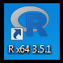


Install the `installr` package into R by typing

```{r, eval=FALSE}
install.packages("installr")
```  

into the Console.

After the package is finished installing, call the package by typing 

```{r, eval=FALSE} 
library(installr)
``` 

into the Console. You can now update your R software and packages to the latest versions by typing 

```{r, eval=FALSE}
updateR() 
```

into the Console. Then R will walk you through a detailed and intuitive process of updating your R software and packages to the latest versions.

#### Updating R on (Mac) OS X

Open RStudio again, and type the following lines of code into the Console:

```{r, eval=FALSE}
install.packages('devtools') #assuming it isn't already installed
library(devtools)
install_github('andreacirilloac/updateR')
library(updateR)
updateR(admin_password = "os_admin_user_password")
```

R will then walk you through a detailed and intuitive process of updating your R software and packages to the latest versions.

#### Updating R on Linux

[This resource](https://stackoverflow.com/questions/10476713/how-to-upgrade-r-in-ubuntu) will walk you through how to update your R software and packages to the latest versions on Linux.

### Updating R Packages Without Updating R

Updating out-of-date packages that were installed from CRAN (with `install.packages()`) is easy with the `update.packages()` function. Type this function into the RStudio Console.

```{r, eval=FALSE}
update.packages()
```

After entering this function, it will ask you what packages you want to update. To update all packages at once, use `ask = FALSE`.

```{r, eval=FALSE}
update.packages(ask = FALSE)
```

To update packages installed from `devtools::install_github()`, type the following function into your RStudio Console (I would also recommend saving this function in an R Script for later use):

```{r, eval=FALSE}
update_github_pkgs <- function() {
  # check/load necessary packages
  # devtools package
  if (!("package:devtools" %in% search())) {
    tryCatch(require(devtools), error = function(x) {warning(x); cat("Cannot load devtools package \n")})
    on.exit(detach("package:devtools", unload=TRUE))
  }

  pkgs <- installed.packages(fields = "RemoteType")
  github_pkgs <- pkgs[pkgs[, "RemoteType"] %in% "github", "Package"]

  print(github_pkgs)
  lapply(github_pkgs, function(pac) {
    message("Updating ", pac, " from GitHub...")

    repo = packageDescription(pac, fields = "GithubRepo")
    username = packageDescription(pac, fields = "GithubUsername")

    install_github(repo = paste0(username, "/", repo))
  })
}
```

Then call the function.

```{r, eval=FALSE}
update_github_pkgs()
```

### Updating RStudio
To update RStudio, open RStudio and go to `Help > Check for Updates` to install the newest version.

## References

1. [Excel Functions (Alphabetical)](https://support.office.com/en-us/article/Excel-functions-alphabetical-b3944572-255d-4efb-bb96-c6d90033e188)

2. [R for Excel Users](https://www.rforexcelusers.com/)

3. [Burns Statistics](http://www.burns-stat.com/)

4. [The R Graph Gallery](https://www.r-graph-gallery.com/)

5. [BERT Documentation](https://bert-toolkit.com/)

## Contact

If you have any comments or suggestions about this manual, please contact the author, [Alyssa Columbus](mailto:acolumbu@uci.edu).


### Please consider a donation!

I am a huge advocate of open source software (e.g. R) and open science, so a version of this manual will always be freely available! That said, updating this manual takes a bit of time, so if you like this book and want to see it get even better, consider donating at [paypal.me/AlyssaColumbus](https://paypal.me/AlyssaColumbus). It really means a lot!